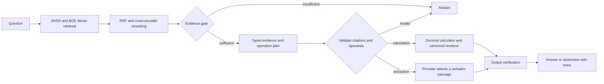

# FinRAG Auditor

A financial-document retrieval and evaluation system with a bounded LangGraph
workflow, auditable arithmetic, report-scoped evidence metrics, and explicit
abstention. It combines BM25, BGE embeddings, reciprocal rank fusion, and
cross-encoder reranking over FinQA financial reports.

The default deterministic provider is an infrastructure baseline. Its planner is
intentionally simple and has low answer accuracy. No model-backed generation
accuracy or production financial reliability is claimed.

## Evaluation correction

The v1 evaluator compared report-local IDs such as `table_1` without checking
report identity. It could credit evidence from the wrong company. Numerical
scoring also ignored explicit scales and conflicting currencies, and nDCG could
count repeated evidence more than once.

The corrected metrics are versioned `report-scoped-v2` and `financial-units-v2`.
Original files are preserved unchanged under [artifacts/legacy_v1](artifacts/legacy_v1/README.md).
The old **+10.92-point MRR improvement (95% CI 8.65–13.25)** is superseded and must
not be used as a current result. Comparisons reject unversioned/v1 score rows.

The saved workflow hits support these independently reproducible corrections:

| Original workflow cohort | Questions | Corrected Recall@5 | Corrected MRR | Numerical accuracy |
|---|---:|---:|---:|---:|
| Historical test, TinyBERT | 120 | 62.85% | 58.81% | 2.50% |
| Development smoke, BGE | 50 | 72.67% | 78.50% | 2.00% |

These are **regrades of old predictions**, not fresh runs of the current workflow.
The numerical-grader fix changes neither cohort's aggregate answer score. The
new output verifier was not retroactively applied because saved rows omit passage
text. Regrades cover only the saved workflow hits, not the other retrieval methods.
See [regraded artifacts](artifacts/regraded_v2/) and run:

```bash
python scripts/regrade_legacy.py
```

## Fresh development results

The corrected evaluator was rerun on 2026-09-05 UTC, using all **883 development
questions and 8,783 chunks**, real neural backends, and no generation API calls.
Both rerankers used the same retrieval configuration and development corpus.

| Configuration | Recall@5 | MRR | nDCG@5 |
|---|---:|---:|---:|
| BM25 | 52.55% | 51.55% | 47.27% |
| BGE dense | 58.02% | 55.39% | 51.54% |
| Hybrid RRF | 59.91% | 58.59% | 54.06% |
| Hybrid + TinyBERT | 57.03% | 50.92% | 48.34% |
| Hybrid + BGE reranker | **63.42%** | **61.31%** | **57.06%** |

BGE minus TinyBERT yields **+10.38 MRR points (95% paired bootstrap CI:
8.27–12.61)** and **+6.39 Recall@5 points (4.44–8.43)**. Intervals use 1,000
resamples and seed 42. Relative to hybrid without reranking, BGE adds 2.72 MRR
points. These are development comparisons, not untouched test estimates.
[Comparison](artifacts/retrieval_ablation/reranker_comparison_dev_v2.json) ·
[Runtime and model snapshots](artifacts/retrieval_ablation/dev_v2_run_manifest.json).

The rerun of the legacy planner reaches **5.55% execution accuracy with retrieved
evidence and 9.51% with oracle evidence**, a 3.96-point gap. Correct report-scoped
gold-evidence availability is 69.31%. This remains evidence of a weak planner,
not evidence that safe arithmetic makes its operation selection correct.
[Planner audit](artifacts/planner_audit/legacy_planner_dev_v2/planner_audit.json).

The current workflow was also run on 50 development questions plus 10 synthetic
source-withheld cases: 35 answers (70% coverage), 1/50 numerically correct,
10/10 withheld-case abstentions, 80% citation precision and 55.95% citation recall
among answered questions. It uses `deterministic-extractive-v2` with canonical
calculation output and verbatim extraction. These small-cohort results do not
establish useful answer accuracy or stronger model-backed generation quality.
[Workflow results](artifacts/results/dev_quick_v2/answer_metrics.json).

## Architecture and output contract



1. Retrieval returns ranked chunks with report IDs, source IDs, and component scores.
2. The evidence gate applies minimum chunk/token counts, query overlap, and the
   reranker threshold. The token-overlap fallback has a separate threshold;
   without one, the workflow abstains. A neural threshold is never reused for it.
3. A provider emits a typed plan containing selected citation IDs, answer type,
   arithmetic expression, and result unit. Gold answers/programs are never supplied.
4. Validation rejects invented or duplicate citations, unsupported signed operands,
   unsafe arithmetic, inconsistent answer types, and excessive evidence selection.
5. Calculations use a restricted Decimal AST evaluator. The final answer is rendered
   directly from its result, explicit result unit, and selected citations; a model
   cannot rewrite the calculated number or append unchecked explanations.
6. Extractions must be one contiguous verbatim passage in every cited chunk.
   Invented numbers, changed dates, and paraphrases fail this output contract.
7. Missing/invented/malformed citations or invalid output route to
   `INSUFFICIENT_EVIDENCE`. Trace events record decisions and timings.

These checks establish output consistency and evidence identity. They do **not**
prove that a retrieved passage answers the question or that a plan chose the right
financial relationship, period, operation, currency, or scale. Planner quality is
measured separately. The deliberately weak deterministic planner is retained for
controlled infrastructure tests and oracle-evidence diagnosis.

## Retrieval and data

- Official [FinQA](https://github.com/czyssrs/FinQA) development split: 883 questions;
  full development corpus: 8,783 chunks with the committed chunking configuration.
- Long text uses 900-character chunks with 120-character overlap. Table chunks
  preserve row labels and headers, including row zero in headerless tables.
- Dense embeddings: `BAAI/bge-small-en-v1.5`, normalized vectors, NumPy dot products.
- RRF pools 15 lexical and 15 dense candidates, with `k=60`; reranking returns five.
- Default reranker: `BAAI/bge-reranker-base`; TinyBERT remains a comparison baseline.
- Recall and citation coverage match `(report_id, source_id)`. MRR uses the first
  relevant chunk. nDCG@5 uses binary novel-evidence gain: a source already covered
  by an earlier chunk cannot earn repeated credit through overlapping chunks.
- Answer scoring expands thousand/million/billion/trillion and compares explicit
  currencies. Missing currency is unspecified because FinQA labels often omit it;
  conflicting explicit currencies never match. Percentages remain distinct from
  bare ratios. Missing scale is never inferred. For legacy prose scoring, the last
  percentage is preferred; otherwise the last quantity is used.

Model selection uses development data. The original 120 test questions have been
observed during development. The frozen `data/held_out/test_v2_manifest.json`
contains a different 120-question cohort and remains unevaluated. It is question-
disjoint from the historical cohort, not guaranteed report-disjoint. Source-withheld
cases are synthetic abstention probes, not a natural unanswerable benchmark.

## Install and run

Python 3.11 and 3.12 are supported.

```bash
python3.11 -m venv .venv
source .venv/bin/activate
pip install -e ".[dev]"
python scripts/download_finqa.py

# Development workflow and retrieval-only comparison runs
finrag evaluate --config configs/quick_eval.yaml
finrag evaluate-retrieval --config configs/reranker_bge_dev.yaml
finrag evaluate-retrieval --config configs/reranker_tinybert_dev.yaml
finrag audit-planner --config configs/planner_audit.yaml
finrag calibrate-abstention --config configs/abstention_bge_dev.yaml

finrag ask "What was the change in revenue?" --report-id REPORT_ID
streamlit run app.py

# Optional model provider; requires the named environment credential
pip install -e ".[openai]"
finrag evaluate --config configs/groq_smoke.yaml

# Final cohort: only after model, prompt, and threshold selection is complete
finrag evaluate --config configs/full_eval.yaml
```

The downloader verifies pinned SHA-256 checksums. Credentials are read from the
configured environment-variable name, never embedded in config or artifacts.
OpenAI-compatible providers make a structured planning call; only extractive plans
need a subsequent passage-selection call. Calculations require no second model call.

`configs/base.yaml` defines chunking, models, evidence rules, and planning limits.
Its historical BGE threshold is 0.6461, selected on 200 development questions and
200 source-withheld counterparts with an 80% minimum answerable-retention constraint.
That calibration yielded 80.5% acceptance and 48.5% withheld-case abstention. These
are gate decisions, not answer accuracy or probabilities. Calibration must be
repeated when the scoring backend/configuration changes.

`evidence.fallback_min_reranker_score` defaults to `null` (abstain). Set a separate
0–1 threshold only after evaluating the token-overlap backend. Offline synthetic
infrastructure tests explicitly use 0.0; that is not a quality calibration.

## Reproducibility and artifacts

Corpus embeddings are cached by model name and exact chunk contents under
`artifacts/indexes/`. Evaluation checkpoint identities include configuration,
raw-data contents, selected examples, corpus contents, package-source contents
(including dirty edits and prompts), dependency versions, provider/backends, and
metric versions. Changing data or code invalidates resume. Operational pacing and
resume flags do not. Disabling resume starts a fresh checkpoint instead of appending
duplicate rows. Mutable remote model names remain a reproducibility limitation;
retain the exact model snapshot/runtime used for a reportable run.

New retrieval rows preserve report IDs, gold source IDs, and complete ranked
hit identities for every method. This allows independent regrading without
rerunning models. New workflow rows record metric versions and report identities.

- `artifacts/legacy_v1/`: original, superseded runs retained for provenance.
- `artifacts/regraded_v2/`: corrected scoring of saved historical workflow outputs.
- `artifacts/retrieval_ablation/`: fresh retrieval runs and paired comparisons.
- `artifacts/planner_audit/`: retrieved-versus-oracle planner diagnostics.
- `artifacts/results/<run_name>/`: workflow scores, predictions, traces and latency.
- `artifacts/abstention_calibration/`: backend-specific gate experiments.

The UI labels regrades explicitly and only displays current-version evaluation
artifacts as current results. It does not present citation validity as verified
financial correctness. Raw datasets, model weights, caches, and credentials are
excluded from Git.

## Tests and CI

```bash
HF_HUB_OFFLINE=1 TRANSFORMERS_OFFLINE=1 pytest --cov=finrag
ruff check .
mypy src/finrag
finrag --version
python -m finrag --help
```

The expanded local suite passes 114 tests at approximately 93% combined line/branch
coverage. CI checks Python 3.11/3.12, Ruff, mypy, pytest with an enforced 85% coverage floor,
import/CLI smoke tests, and the frozen manifest digest. Docker builds and CLI smoke
tests run in CI. Regression tests cover report-ID collisions, duplicate evidence,
financial scales/currencies/signs, calculator-output integrity, exact passage
verification, fallback abstention, and content-sensitive checkpoint reuse.

## Limits

This is a research and portfolio system. The baseline planner does not provide
useful financial-answer accuracy, and a stronger model-backed planner has no
completed benchmark here. Exact quotations and safe calculations still require
correct evidence and operation selection. The top-five evidence window can miss
required information; row chunking does not reconstruct multi-page tables or
visual layouts. Results are specific to their documented cohort, backend, runtime,
and scoring version. No financial decision should rely solely on the output.
