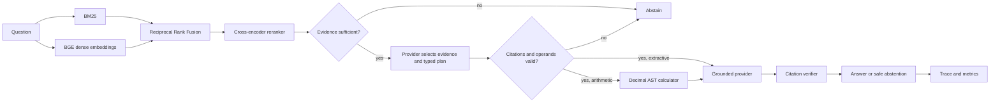

# FinRAG Auditor

**Grounded financial-document RAG and agentic evaluation system**

FinRAG Auditor answers questions over financial reports while exposing the parts
of a retrieval-augmented system that often disappear behind a single accuracy
number: which chunks were retrieved, how rankings changed, whether the evidence
was strong enough, which arithmetic was executed, whether citations were real,
when the system abstained, and how long each stage took.

The repository is credential-optional. Its deterministic extractive provider
keeps ingestion, retrieval, LangGraph routing, calculation, citation validation,
and evaluation reproducible without paid calls. The provider is intentionally
weak at answer synthesis; the verified results below report that weakness rather
than presenting retrieval quality as answer quality.

## Why naive financial RAG fails

Financial reports mix prose, multi-column tables, dates, units, accounting
negatives, and questions whose answer is not written verbatim. Flattening a table
can detach a value from its row or year. Dense retrieval can miss exact figures;
lexical retrieval can miss paraphrases. A generic reranker can make a good fused
ranking worse. Even when the correct operands are retrieved, selecting or ordering
them incorrectly produces a confidently wrong calculation. A syntactically valid
citation also does not prove that it points to the gold supporting evidence.

FinRAG Auditor measures these failures separately.

## Architecture



The workflow is a bounded LangGraph state machine. It has no autonomous retry
loop and stores operational trace events—not hidden chain-of-thought:

1. `retrieve_evidence` returns ranked chunks, component scores, IDs, and metadata.
2. `evidence_sufficiency` applies configured token-overlap and reranker-logit rules.
3. `plan_answer` asks the configured provider for a typed decision, selected
   evidence IDs, answer type, and optional calculator expression.
4. `validate_plan` rejects unreturned evidence IDs, unsafe syntax, excessive
   context selection, and numeric operands absent from selected chunks.
5. `calculate` executes only validated, whitelisted `Decimal` arithmetic.
6. `generate_answer` sees only selected evidence, the validated plan, and the
   calculator result.
7. `verify_citations` rejects missing, malformed, or invented chunk IDs.
8. Weak evidence, invalid plans, calculator errors, or invalid citations route
   to `INSUFFICIENT_EVIDENCE`.

The deterministic provider wraps the original keyword/position planner only for
offline infrastructure testing. Model-backed providers perform both planning and
generation; generation can no longer merely verbalize a precomputed heuristic result.

## Data and evaluation split

The project uses [FinQA](https://github.com/czyssrs/FinQA), introduced by
[Chen et al. at EMNLP 2021](https://aclanthology.org/2021.emnlp-main.300/).
The official project site states that the dataset is licensed under
[CC BY 4.0](https://creativecommons.org/licenses/by/4.0/); the official GitHub
repository's root license is MIT for repository code. The distinction and pinned
file checksums are recorded in `DATASET_LICENSE.md` and `data/manifest.json`.

Raw data is downloaded locally and ignored by Git. The historical baseline used
**120 questions from the official test split**, one per report, across
**120 reports and 3,222 chunks**. The corpus contains only those selected reports,
not the entire split. Among the 120 questions, 47 have text supporting evidence
and 91 have table supporting evidence; some require both. FinQA is a numerical
reasoning benchmark, so this run does **not** include a separate text-answer task.

Those 120 questions have since been inspected and therefore are no longer called
held out. Their artifacts remain unchanged as a historical baseline. Before the
planner or reranker redesign, a replacement cohort was frozen at
`data/held_out/test_v2_manifest.json`: 120 different test questions across 120
reports, selected from the 1,027 questions outside the historical cohort with seed
2027. Its ordered ID list and SHA-256 digest are committed. It must not be used for
model, threshold, prompt, or provider selection.

The historical development quick run used the earlier zero-logit gate; the current
BGE threshold was calibrated separately as documented below. Gold supporting IDs
are used only to score retrieval and citations; they are never passed to retrieval,
reranking, planning, or generation.

Twenty additional unanswerable cases in the historical run were constructed by
running the first 20 test questions against a corpus with their source report
removed. They are labeled
synthetic and used only for abstention evaluation.

## Installation

Python 3.11 is the verified runtime.

```bash
python3.11 -m venv .venv
source .venv/bin/activate
python -m pip install --upgrade pip
pip install -e ".[dev]"
python scripts/download_finqa.py
```

The downloader fetches `dev.json` and `test.json` from the authors' repository and
fails if their SHA-256 checksums differ from the manifest.

## Run

```bash
# 50-question development run
finrag evaluate --config configs/quick_eval.yaml

# Frozen 120-question test-v2 run; use only after configuration is fixed
finrag evaluate --config configs/full_eval.yaml

# Isolate the legacy planner on all 883 dev questions, with retrieved and oracle evidence
finrag audit-planner --config configs/planner_audit.yaml

# Retrieval-only development ablation; makes no generation calls
finrag evaluate-retrieval --config configs/reranker_bge_dev.yaml

# Calibrate BGE sufficiency on dev answerable/source-withheld pairs
finrag calibrate-abstention --config configs/abstention_bge_dev.yaml

# Optional free-tier model-backed development run (requires GROQ_API_KEY)
pip install -e ".[openai]"
finrag evaluate --config configs/groq_dev.yaml

# One question; optionally add --report-id
finrag ask "What was the change in fair value during 2010?"

# Interactive audit UI
streamlit run app.py

# Tests and static checks
pytest
ruff check .
mypy src/finrag
```

Long workflow evaluation is append-checkpointed under `artifacts/checkpoints/`
using a fingerprint of configuration, provider, backends, and ordered question IDs.
Repeating an interrupted command skips completed
evaluation IDs and rewrites the canonical result files from the combined run.
Changing any fingerprinted input creates a separate checkpoint, preventing stale
extractive predictions from leaking into a model-backed run.

## Retrieval and chunking

- Text paragraphs retain their original `text_N` identity. Long paragraphs use
  900-character chunks with 120-character overlap.
- Table row zero is always preserved as `table_0` because some FinQA tables are
  headerless and store real values there. Later rows are serialized independently
  as `header = value` pairs. Every chunk retains report ID, row identity, raw row,
  header metadata where applicable, and source type.
- BM25 uses `rank-bm25`.
- Dense retrieval uses `BAAI/bge-small-en-v1.5` with normalized embeddings and a
  transparent NumPy inner-product index.
- Hybrid retrieval uses RRF with `k=60`, pooling 15 lexical and 15 dense candidates.
- The selected full-pipeline reranker is `BAAI/bge-reranker-base`; TinyBERT is
  retained only as the documented baseline configuration.
- The top five chunks flow into the graph.

The code includes explicitly named hashing and token-overlap fallbacks for offline
CI/interface tests. Final results below did **not** use either fallback; backend
names are embedded in every result artifact.

## Verified experiments

Run date: 2026-08-17. Hardware: local Apple Silicon CPU. Unless stated otherwise,
bootstrap intervals use 1,000 deterministic percentile resamples.

### Historical retrieval ablation (120 official test questions)

| Configuration | Recall@1 | Recall@3 | Recall@5 | MRR | nDCG@5 | Median query latency |
|---|---:|---:|---:|---:|---:|---:|
| BM25 | 37.92% | 53.26% | 62.29% | 60.53% | 59.15% | 9.04 ms |
| BGE dense | 45.07% | 64.44% | **73.19%** | 71.33% | **75.50%** | 32.24 ms |
| Hybrid RRF | **48.54%** | 63.68% | 72.85% | **74.63%** | 74.24% | 49.48 ms |
| Hybrid + TinyBERT reranker | 35.49% | 56.25% | 67.57% | 62.07% | 63.45% | 73.76 ms |

Selected 95% bootstrap intervals:

- Hybrid Recall@1: 41.39%–56.04%.
- Hybrid MRR: 68.01%–81.00%.
- Dense Recall@5: 67.01%–79.31%.
- Reranked Recall@5: 60.55%–74.31%.

These numbers are retained for provenance but no longer represent an untouched
test estimate. RRF produced the best top-1
recall and MRR, while the tested general-domain cross-encoder **reduced** Recall@5
from 72.85% to 67.57% and increased median latency by 24.29 ms. Reranking is not
automatically beneficial; it needs domain validation.

### Development reranker selection (883 official dev questions)

After preserving `table_0`, both rerankers were evaluated on the same full dev
corpus (8,783 chunks), questions, fused 15-candidate lists, and top-five cutoff.

| Configuration | Recall@1 | Recall@3 | Recall@5 | MRR | nDCG@5 | Amortized reranker time/query |
|---|---:|---:|---:|---:|---:|---:|
| Hybrid RRF | 41.57% | 58.98% | 66.71% | 66.06% | 70.39% | — |
| Hybrid + TinyBERT-L-2 | 34.57% | 52.70% | 63.12% | 57.89% | 62.78% | 15.85 ms |
| Hybrid + BGE reranker base | **42.63%** | **62.62%** | **71.08%** | **68.80%** | **74.83%** | 1,060.78 ms |

In the paired BGE-minus-TinyBERT comparison, MRR improved by 10.92 points
(95% bootstrap CI 8.65–13.25), Recall@5 by 7.96 points (5.78–9.92), and nDCG@5
by 12.06 points (9.63–14.40). Relative to no reranker, BGE improved Recall@5 by
4.36 points and MRR by 2.74 points. BGE is therefore the accuracy-selected
reranker, while hybrid RRF remains the documented low-latency option. Timing is
offline batched CPU time amortized across questions, not online latency.

### Development abstention calibration

The BGE gate was calibrated on 200 dev questions and 200 synthetic counterparts
whose source reports were excluded. At threshold zero, it accepted 100% of
answerable cases but abstained on only 0.5% of source-withheld cases. Unconstrained
balanced optimization chose 0.934 but retained only 61% of answerable questions,
so it was rejected. With a predeclared minimum 80% answerable-retention constraint,
the selected threshold is **0.6461**: 80.5% answerable acceptance, 48.5% correct
source-withheld abstention, and 64.5% balanced gate accuracy. Acceptance is a
sufficiency decision, not answer correctness.

### Redesigned end-to-end development smoke run

The refactored graph was run over 50 dev questions plus 10 source-withheld cases
using real BGE retrieval/reranking and `deterministic-extractive-v1`; it made no API
calls. BGE improved Recall@5 from 74.83% for hybrid RRF to 83.00% and MRR from
81.13% to 82.67%. Workflow coverage was 72%; all 10 source-withheld cases abstained.
Citation precision was 77.78% and recall was 54.40%. Numerical accuracy remained
2.00%, as expected from the legacy fallback planner/generator. Median online
reranking latency was 1.62 seconds and median end-to-end latency was 1.69 seconds
(P95 2.67 seconds). These are smoke results, not LLM-generation metrics.

### Legacy planner audit (883 official development questions)

The pre-redesign planner was evaluated without any generation model. It was run
once on the legacy TinyBERT-reranked top-five chunks and once on oracle gold-support
chunks. Operator sequences and operand multisets were normalized against FinQA's
gold programs; execution was compared with the gold answer at 2% tolerance.

| Condition | Gold evidence available | Operator accuracy | Operand-set accuracy | Program structure | Execution accuracy |
|---|---:|---:|---:|---:|---:|
| Retrieved top five | 76.90% | 11.44% | 3.62% | 2.60% | 5.44% |
| Retrieved, conditional on gold available | 100.00% | 12.37% | 4.71% | 3.39% | 7.07% |
| Oracle gold evidence | 100.00% | 11.89% | 6.46% | 4.42% | 9.40% |

The 23.10% missing-evidence rate is a retrieval failure. More importantly, oracle
evidence improves execution by only 3.96 percentage points: positional operand
selection and shallow operator rules remain a large independent bottleneck. This
audit also exposed headerless FinQA tables whose financial values occupy row zero;
the chunker now preserves that row as `table_0`, restoring 100% oracle availability.

### Historical full workflow

The answer provider was exactly `deterministic-extractive-v1`, temperature 0,
with no API calls and therefore **$0 API cost**.

| Metric | Result |
|---|---:|
| Answerable questions | 120 |
| Answered / coverage | 112 / 93.33% |
| Answerable abstention rate | 6.67% |
| Exact match | 0.83% |
| Normalized numerical accuracy (2% tolerance) | 2.50% |
| Accuracy among answered questions | 2.68% |
| Citation reference integrity among answered cases | 100.00% |
| Citation precision vs. gold evidence | 51.79% |
| Citation evidence recall | 37.13% |
| Answers with at least one valid retrieved citation | 100.00% |
| Correct abstention on 20 synthetic unanswerable cases | 35.00% |

The historical JSON calls reference integrity `citation_validity`; current code
emits `citation_reference_integrity` to make clear that verification enforces this
property. It is an invariant, not evidence-quality performance. Numerical
accuracy's bootstrap 95% interval is 0.00%–5.83%. This project does not
claim useful answer-generation quality from the fallback. Citation-ID validity
only means IDs were well formed and present in the current retrieval result;
citation precision and recall show the harder evidence-selection problem.

### Latency

| Stage | Median | P95 |
|---|---:|---:|
| Retrieval (BM25 + dense + RRF) | 53.18 ms | 123.37 ms |
| Cross-encoder reranking | 17.41 ms | 35.00 ms |
| Deterministic generation | 0.02 ms | 0.05 ms |
| End-to-end graph | **74.05 ms** | **144.00 ms** |

Model loading and corpus embedding are startup costs and are not included in
per-question latency. An API-backed provider would add network latency and token
cost; no such measurements are claimed here.

## Audited examples

### Successful grounded calculation

Question (`CB/2010/page_83.pdf-1`):

> What is the change in fair value of financial market instruments as part of
> the hedging strategy during 2010?

The workflow retrieved gold text chunk `text_17`, safely executed `21 - 47`, and
returned `-26` with `[CITATION: CB/2010/page_83.pdf/text_17]`. The answer matched
within numerical tolerance, and citation precision/recall were both 100%.

### Correct abstention

For the synthetic unanswerable version of “What is the percentage change in total
cost of aircraft fuel in 2013?”, the source report was withheld. The strongest
wrong-report candidate had a reranker logit of -2.595, below the configured zero
threshold, so the graph returned `INSUFFICIENT_EVIDENCE` before calculation or
generation.

### Representative failure

For `AAPL/2006/page_131.pdf-2`, the correct evidence was partly retrieved and the
citation ID was valid, but the heuristic planner selected `100000 + 57162311`
instead of the two ownership operands. It returned `57,262,311` instead of
`364,400`. This demonstrates why “retrieved something relevant” and “citation is
valid” are insufficient proxies for correct numerical reasoning.

## Configuration

`configs/base.yaml` owns chunking, candidate counts, models, evidence thresholds,
provider settings, numerical tolerance, bootstrap count, and checkpoint behavior.
`quick_eval.yaml` selects 50 development questions. `planner_audit.yaml` and the
reranker development configs use all 883 dev questions. `full_eval.yaml` loads the
committed frozen test-v2 manifest rather than resampling. Pydantic rejects unknown
keys, invalid overlap, candidate
pools smaller than `top_k`, and out-of-range tolerances.

The evidence gate requires at least one chunk, four content tokens, 14% content-token
overlap, and (for BGE-reranked results) a top score of at least 0.6461. The score
threshold was selected on dev under the 80% answerable-retention constraint above;
it is not a calibrated probability.

`OpenAICompatibleProvider` supports both the standard OpenAI endpoint and a
configured compatible endpoint. It performs two distinct calls: structured plan
creation and grounded final generation. `configs/groq_dev.yaml` uses Groq's base
URL and reads only `GROQ_API_KEY` from the environment. Keys are never accepted in
YAML, traces, or result metadata. No compatible-provider accuracy is reported here
because neither supported key was present during verification.

## Streamlit UI

`app.py` supports report-scoped or corpus-wide questions and displays:

- answer versus abstention status;
- cited source text beside the answer;
- retrieval, RRF, and reranker scores;
- calculator expression/result;
- citation-verification outcome;
- graph execution trace and per-stage latency;
- saved metrics, latency samples, and the ablation chart.

If data or credentials are missing, the app preserves access to saved evaluation
artifacts and shows an actionable error. The default provider needs no credentials.

## Tests and CI

The local suite contains **37 passing tests** covering FinQA parsing, table
serialization, metadata preservation, BM25, dense/reranker fallback interfaces,
RRF, safe arithmetic, percentage normalization, financial number comparison,
retrieval metrics, citation parsing and invention, evidence routing, abstention,
structured plan validation, LangGraph transitions, config validation, frozen
manifest selection, paired reranker comparison, threshold selection, deterministic
sampling, and checkpoint resume behavior.

GitHub Actions runs Ruff, all tests with mocked/fallback neural calls, and a graph
import smoke test on Python 3.11. Raw datasets, model caches, weights, and indexes
are ignored. A Dockerfile is included, but Docker was not installed on the verified
machine, so this README does **not** claim a successful image build.

## Result artifacts

- `artifacts/results/retrieval_metrics.json` — aggregate metrics and 1,000-sample CIs
- `artifacts/results/answer_metrics.json` — answer, citation, coverage, and abstention
- `artifacts/results/ablation.csv` — comparable configuration table
- `artifacts/results/predictions.jsonl` — answerable and synthetic unanswerable traces
- `artifacts/results/latency.csv` — per-case timing
- `artifacts/results/evaluation_metadata.json` — models, sample, split, and chunking
- `artifacts/planner_audit/legacy_planner_dev/` — aggregate and per-question
  retrieved-versus-oracle planner diagnostics
- `artifacts/retrieval_ablation/<run_name>/` — development-only reranker selection
  summaries and per-question retrieval metrics
- `artifacts/abstention_calibration/bge_gate_dev/` — full threshold sweep and
  source-withheld calibration rows
- `artifacts/results/dev_quick/` — redesigned 50-question/10-source-withheld
  end-to-end development smoke run

Every prediction preserves question/report IDs, retrieved source IDs, component
scores, calculator usage, citation decision, graph path, provider, and latency.

## Reproducibility and limitations

- Historical results cover 120 of 1,147 test questions and are not the full FinQA
  benchmark score. Those IDs are now development-observed, not a final held-out set.
- The historical corpus is limited to 120 selected reports. Current reranker and
  planner selection instead use the full 883-question dev split and full dev corpus.
- FinQA is numerical; “text-supported” does not mean a textual-answer benchmark.
- The extractive provider is an infrastructure fallback, not an LLM baseline. Its
  2.5% numerical accuracy must not be represented as production performance.
- Reranker degradation is model/configuration-specific. Replacement selection is
  performed only on dev; the frozen test-v2 cohort remains sealed.
- The historical zero-logit/TinyBERT gate caught only 35% of withheld-evidence
  cases. The selected BGE gate improves dev source-withheld abstention but rejects
  19.5% of answerable dev cases before planning.
- Citation validation prevents invented IDs but cannot by itself prove semantic
  entailment. Gold citation precision was 51.79%.
- Report-row chunking preserves structure but does not reconstruct multi-page
  tables or visual layout.
- Context size is controlled by top-five retrieval. Missing evidence outside that
  window cannot be recovered by generation.
- The OpenAI-compatible provider is implemented but was not called or evaluated;
  no API key was present. Model-backed generation remains an explicit gap.

## Responsible use

This is a research and portfolio system, not financial, investment, accounting,
or legal advice. Financial answers can be materially wrong even when a citation
passes syntactic validation. Verify all source documents and calculations before
making decisions.

## Claims status

The repository supports an engineering claim about a tested retrieval/evaluation
harness and a measured diagnosis of its legacy planner. It does **not** yet support
a resume claim of accurate LLM-grounded generation: no model-backed provider run
has been completed, and the frozen test-v2 cohort is intentionally unevaluated.
Historical test metrics should not be presented as a new held-out result after the
review-driven redesign.
